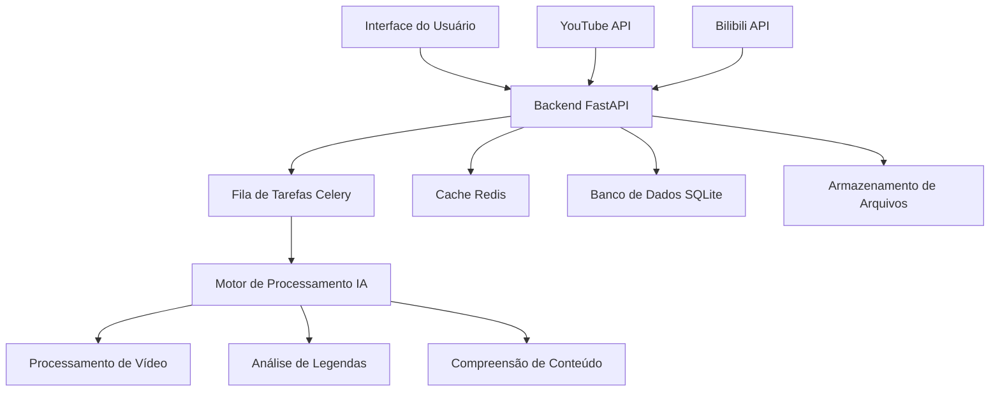

# AutoClip - Sistema de Corte Inteligente de Vídeo com IA


## Sistema de corte de vídeo inteligente baseado em IA

Suporta download de vídeos do YouTube/Bilibili, corte automático e geração inteligente de coleções.

[](https://python.org)
[](https://reactjs.org)
[](https://fastapi.tiangolo.com)
[](https://www.typescriptlang.org)
[](https://celeryproject.org)
[](LICENSE)

**Idioma**: [English](README-EN.md) | [中文](README.md) | [Português](README-PT.md)

</div>

## 🎯 Visão Geral do Projeto

AutoClip é um sistema inteligente de corte de vídeo baseado em IA que pode baixar vídeos automaticamente do YouTube, Bilibili e outras plataformas, extrair clipes interessantes através de análise de IA e gerar coleções de forma inteligente. O sistema adota uma arquitetura moderna de separação frontend-backend, fornecendo uma interface web intuitiva e poderosas capacidades de processamento no backend.

### ✨ Principais Características

- 🎬 **Suporte Multi-plataforma**: Download com um clique do YouTube, Bilibili e upload de arquivos locais.
- 🤖 **Análise Inteligente por IA**: Compreensão do conteúdo de vídeo baseada em modelos de linguagem como Qwen, Groq e Cerebras.
- 🌐 **Suporte a Internacionalização**: Detecta automaticamente o idioma do vídeo e gera títulos e descrições no idioma correspondente (suporta Português, Inglês, Chinês, etc.).
- ✂️ **Corte Automático**: Reconhecimento inteligente de clipes interessantes com corte automático, suportando múltiplas categorias de vídeo.
- 📚 **Coleções Inteligentes**: Coleções de vídeo recomendadas por IA e criadas manualmente com ordenação por arrastar e soltar.
- 🚀 **Processamento em Tempo Real**: Fila de tarefas assíncrona com feedback de progresso em tempo real e comunicação via WebSocket.
- 🎨 **Interface Moderna**: React + TypeScript + Ant Design com design responsivo.
- 📱 **Suporte Móvel [Em Desenvolvimento]**: Design responsivo, melhorando a experiência em dispositivos móveis.
- 🔐 **Gerenciamento de Contas [Em Desenvolvimento]**: Suporte para gerenciamento de múltiplas contas do Bilibili com verificações automáticas de integridade.
- 📊 **Estatísticas de Dados**: Funcionalidade completa de gerenciamento de projetos e estatísticas de dados.
- 🛠️ **Fácil Implantação**: Scripts de inicialização com um clique, suporte a Docker e documentação detalhada.
- 📤 **Upload para Bilibili [Em Desenvolvimento]**: Upload automático de vídeos cortados para o Bilibili.
- ✏️ **Edição de Legendas [Em Desenvolvimento]**: Funcionalidade visual de edição e sincronização de legendas.

## 🏗️ Arquitetura do Sistema



### Stack Tecnológica

#### Tecnologias do Backend

- **FastAPI**: Framework web Python moderno com geração automática de documentação de API.
- **Celery**: Fila de tarefas distribuída suportando processamento assíncrono.
- **Redis**: Broker de mensagens e cache para gerenciamento de status de tarefas.
- **SQLite**: Banco de dados leve com suporte para upgrade para PostgreSQL.
- **yt-dlp**: Download de vídeos do YouTube suportando múltiplos formatos.
- **Multi-modelo**: Suporte para Qwen, Groq, Cerebras, Gemini, interfaces compatíveis com OpenAI, etc.
- **Motor I18n**: Detecção automática de idioma e injeção dinâmica de prompts.
- **WebSocket**: Comunicação em tempo real e push de progresso.
- **Pydantic**: Validação de dados e serialização.

#### Tecnologias do Frontend

- **React 18**: Framework de interface de usuário com Hooks e componentes funcionais.
- **TypeScript**: Segurança de tipos para melhor experiência de desenvolvimento.
- **Ant Design**: Biblioteca de componentes UI de nível empresarial.
- **Vite**: Ferramenta de build rápida com hot reload.
- **Zustand**: Gerenciamento de estado leve.
- **React Router**: Gerenciamento de rotas.
- **Axios**: Cliente HTTP.
- **React Player**: Reprodutor de vídeo.

## 🚀 Início Rápido

### Requisitos do Ambiente

#### Implantação Docker (Recomendado)

- **Docker**: 20.10+
- **Docker Compose**: 2.0+
- **Memória**: Mínimo 4GB, recomendado 8GB+
- **Armazenamento**: Mínimo 10GB de espaço disponível

#### Implantação Local

- **Sistema Operacional**: macOS / Linux / Windows (WSL)
- **Python**: 3.8+ (recomendado 3.9+)
- **Node.js**: 16+ (recomendado 18+)
- **Redis**: 6.0+ (recomendado 7.0+)
- **FFmpeg**: Dependência para processamento de vídeo
- **Memória**: Mínimo 4GB, recomendado 8GB+
- **Armazenamento**: Mínimo 10GB de espaço disponível

### Inicialização com Um Clique

#### Método 1: Implantação Docker (Recomendado)

```bash
# Clone o projeto
git clone https://github.com/zhouxiaoka/autoclip.git
cd autoclip

# Inicialização com um clique via Docker
./docker-start.sh

# Inicialização em ambiente de desenvolvimento
./docker-start.sh dev

# Parar serviços
./docker-stop.sh

# Verificar status dos serviços
./docker-status.sh
```

#### Método 2: Implantação Local

```bash
# Clone o projeto
git clone https://github.com/zhouxiaoka/autoclip.git
cd autoclip

# Inicialização com um clique (recomendado, inclui verificações completas e monitoramento)
./start_autoclip.sh

# Inicialização rápida (ambiente de desenvolvimento, pula verificações detalhadas)
./quick_start.sh

# Verificar status do sistema
./status_autoclip.sh

# Parar o sistema
./stop_autoclip.sh
```

## 📖 Guia do Usuário

### 1. Download de Vídeo

#### Vídeos do YouTube

1. Clique em "New Project" na página inicial.
2. Selecione "YouTube Link".
3. Cole a URL do vídeo.
4. Clique em "Start Download".

#### Arquivos Locais

1. Clique em "New Project" na página inicial.
2. Selecione "File Upload".
3. Arraste e solte ou selecione arquivos de vídeo.
4. Clique em "Start Processing".

### 2. Processamento Inteligente

O sistema executará automaticamente os seguintes passos:

1. **Preparação de Material**: Download de arquivos de vídeo e legenda.
2. **Análise de Conteúdo**: IA extrai o roteiro do vídeo e informações chave.
3. **Extração da Timeline**: Identifica intervalos de tempo dos tópicos.
4. **Pontuação de Destaque**: Pontuação de IA para cada clipe.
5. **Geração de Títulos**: Gera títulos atraentes para clipes de destaque.
6. **Recomendação de Coleções**: Coleções de vídeo recomendadas por IA.
7. **Geração de Vídeo**: Gera os vídeos cortados e os vídeos de coleção.

## 🔧 Configuração

### Configuração de Variáveis de Ambiente

Crie o arquivo `.env`:

```bash
# Configuração do Banco de Dados
DATABASE_URL=sqlite:///./data/autoclip.db

# Configuração do Redis
REDIS_URL=redis://redis:6379/0

# Configuração da API de IA (Pode ser configurado via interface UI)
API_DASHSCOPE_API_KEY=sua_chave_api_aqui
API_MODEL_NAME=qwen-plus
```

## 🤝 Contribuição

Damos as boas-vindas a todas as formas de contribuição! Seja contribuição de código, melhorias na documentação, relatórios de problemas ou sugestões de funcionalidades.

## 📄 Licença

Este projeto está licenciado sob a [MIT License](LICENSE).
